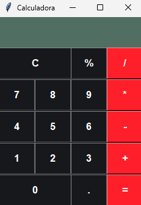

# 🧮 Calculadora em Python (Tkinter)

Uma calculadora simples feita com Python usando Tkinter.

## Funcionalidades
- Soma
- Subtração
- Multiplicação
- Divisão
- Tratamento de erro

## ▶️ Como executar
```bash
python calculadora.py

## 📸 Preview


